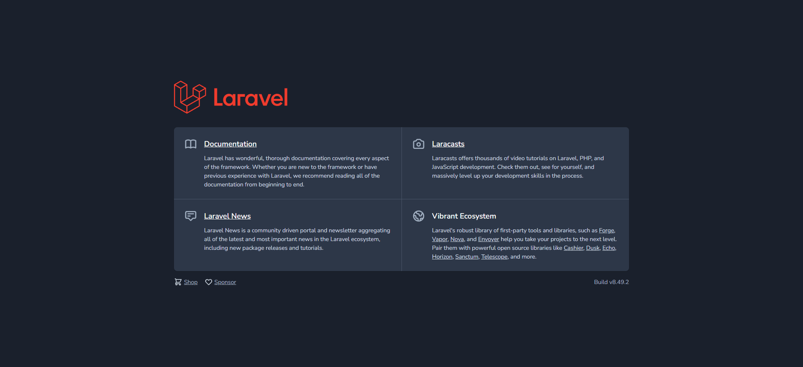

# README DOCKER LARAVEL

## Installation

To build the docker container

```bash
docker-compose up -d
```

## Documentation

In the `dockerfile` the line 2:

```docker
FROM php:7.4-fpm-alpine
```

You define the Php version you want to use in the container.

And in the `docker-compose.yml` file the line 19:

```docker
image: mysql:5.7
```

You define the Mysql version you want to use in the container.

## Usage

In the `src` folder you must put the laravel project that you want the docker to run

This folder is equivalent to the address `[localhost:8000](http://localhost:8000/)`

